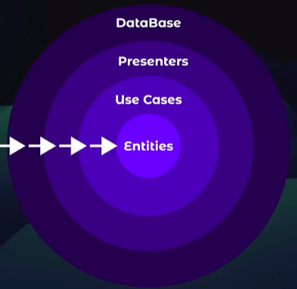
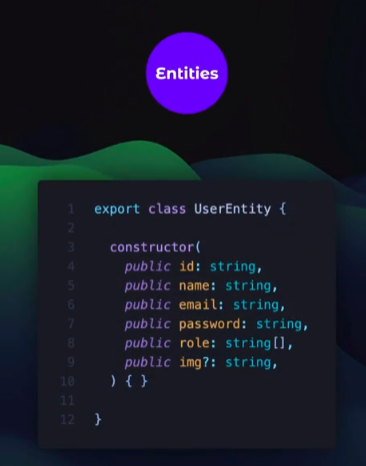
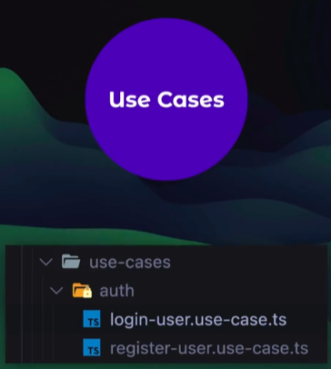
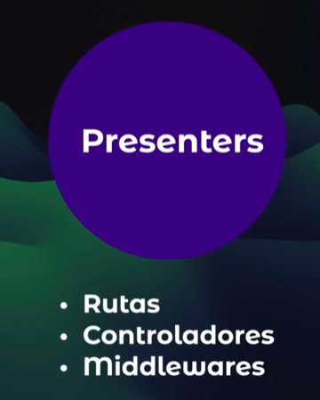
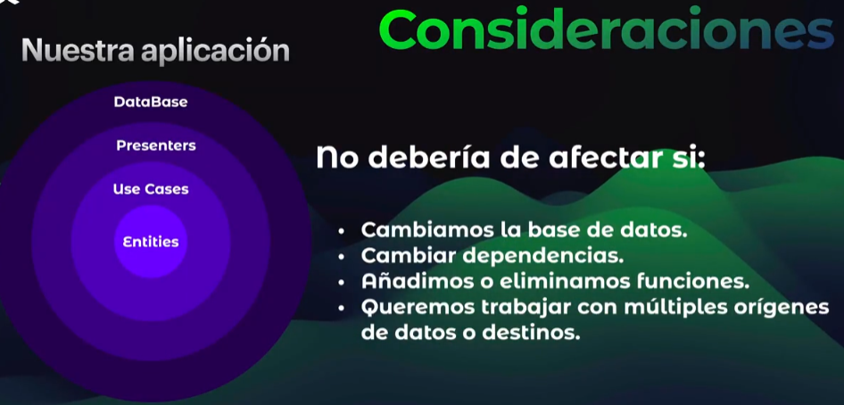
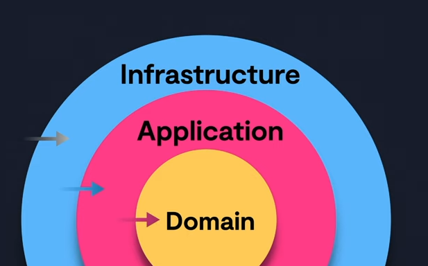

#

## Arquitecura de software

Aquellas reglas que se auto-impone al momento de diseñar y/o implementar la aplicacion y obtener benecifios en base a las reglas que se definio

Propuesta por Robert C. Martin. (Uncle Bob)

Clean architecure es una arquitectura basada en capas que separa(desacopla) la logica del negocio[Product, ProduectSearcher, ProductRepository] de la infraestructura y/o persistencia[Mysql, ProductController].
Separa la capa del dominio de la infraestructura

En MVC, la logica de dominio esta acoplada a la infra estructura. Es decir que el modelo sabe de que base de datos se esta usando.

Si se usa Clean Architecture con un framework las mismas caracteristicas del framework seria parte de la capa de infraestrcutra y asi lo separamos de la logica de dominio. Con ello
el cambio de framework o la actualizacion del mismo es mucho mas facil. Lo mismo que migrar de una data base a otra. Desacoplarnos del framework.

Diferentes tipos de Clean arquitecures:
 - Hexagonal (Tres capas) [Infra, Aplicacion, Dominio]. Con la regla de dependencia de fuera hacia adentro Infra(I/O en nuestro sistema, frameworks, librerias externas, Base de datos) -> Aplicacion(casos de uso) -> Dominio(entidades, value object) 
 - Cebolla
 - Screamming
 - DCI
 - BCE by Ivar Jacobson from his book Object Oriented Software

Pilares de la arquitectura Hexagonal:
- Manteneabilidad
- Escalabilidad
- Testeabilidad

LA comunicación sera de los circulos exteriores(layer) a los layer inferiores pero no viceversa.

- Entities: comprende la regla de negocio fundamentales. Informacion de nuestros usuarios. Es algo bien cercano
a lo que grabamos en BD. Sin embargo es nuestra propia implementacion para la aplicacion. Deberia ser Agnostico.
No importa que la bd de datos cambie. O se le agregue mas o menos cambios en las tablas o colecciones de la BD.
  
- Casos de uso: (Crear usuario, enviar correo, validar informacion, login de usuario) Especificamente realizar una tarea (actividad o accion)
  
- Presentacion: Lo mas cercano a los que consumiran nuestro endpoints
  
- Domain: reglas que gobiernan toda la aplicacion. (aqui estaran los use-cases, adaptadores, repositiorios etc). no debe de tener dependencias externas. Reglas de negocio de la aplicacion. Codigo propio de nosotros.
- infrastructure: Se crearan las implemetnaciones de los Data Sources, Repositorios. Mappers

- DTO: Data transfer Object, objetos que serviran como mensajes de layer a layer
- Data sources: Reglas de negocio, de las cuales nosotros vamos a regir la obtencion de datos (no implementacion)
- Repository: Quienes se comunicaran con nuestro data sources (al igual que data source son abstranciones mas no implementaciones)
- Infraestructura = Conexion a BBDD, estado entrada y salida
- Aplicacion = casos de uso (registrar usuario, crear producto)
- Dominio = modelo

Abstracciones: Definir reglas

